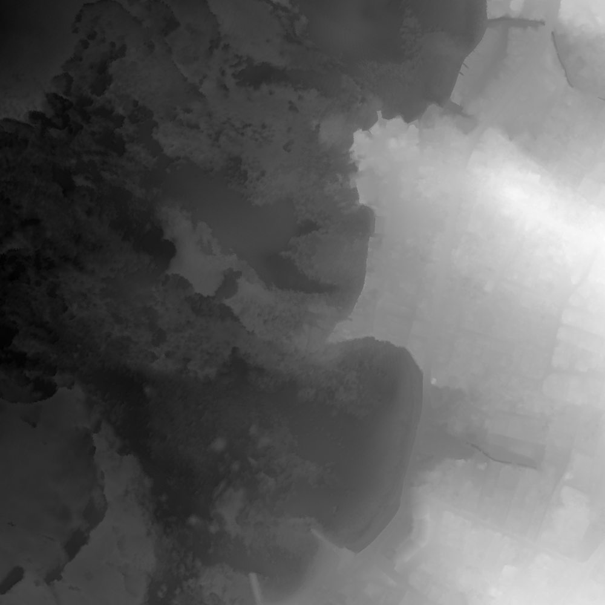
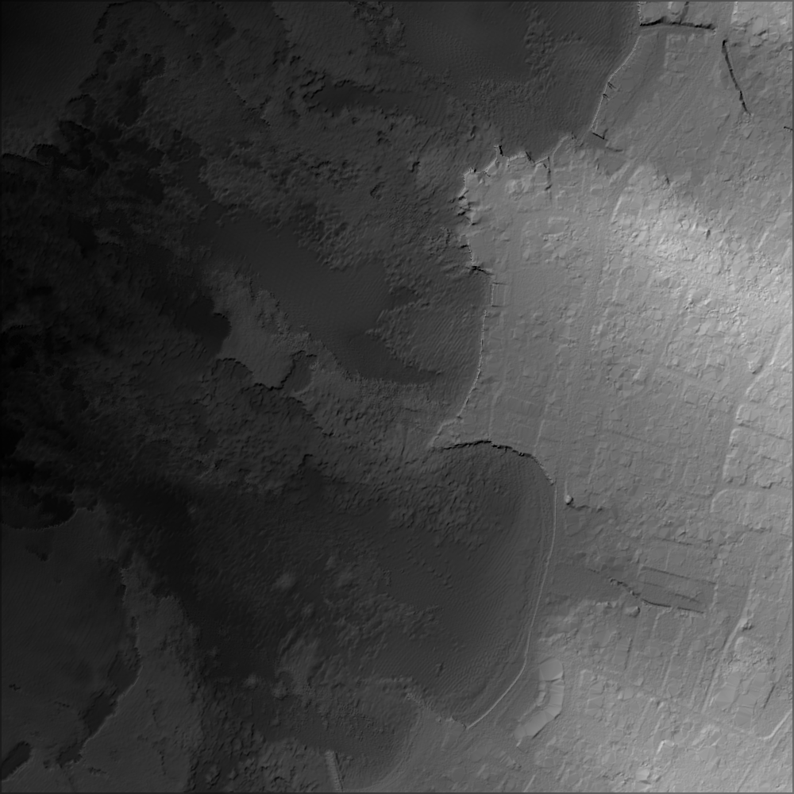
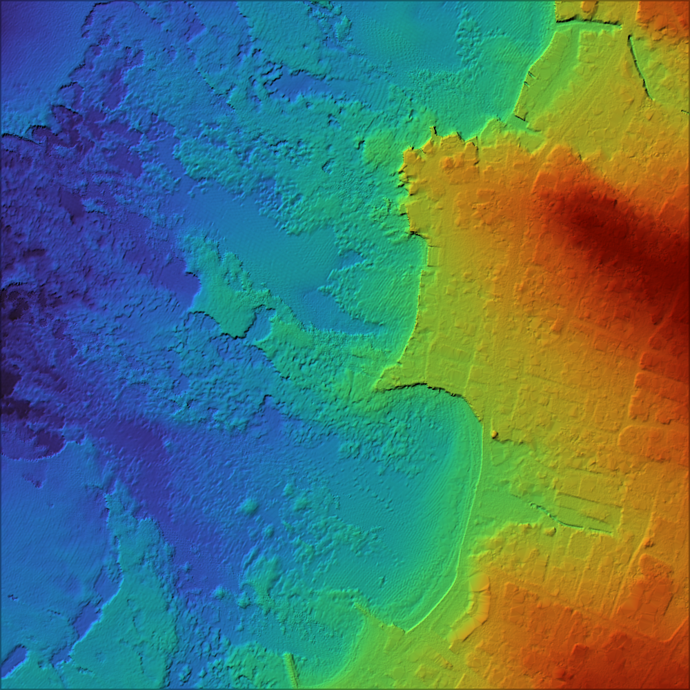
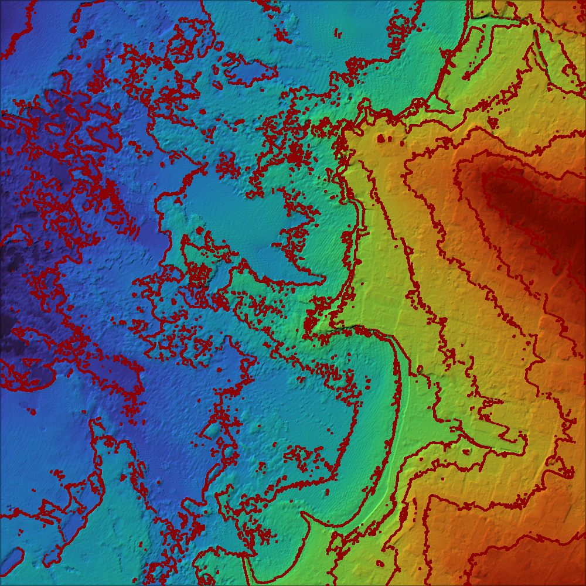

# DEM Viewer

A Rust-based application to visualize high-resolution Digital Elevation Maps (DEM) from ASC files using grayscale, color gradients, and hillshading. The application supports generation of detailed terrain visualizations with optional contour lines overlayed for enhanced topographical understanding.

## 👨‍💻 Authors
- Mohamed Alsisi  
- Pablo Candelas


## 📌 Description
This project is a visualization tool for DEM data based on ASC (ESRI ASCII Raster) files. It includes several powerful features such as:
- Parsing metadata and elevation data from `.asc` files.
- Rendering grayscale elevation maps normalized between minimum and maximum values.
- Applying the **Turbo** color gradient (`colorgrad` crate) to visualize terrain elevation in color.
- Implementing a custom **hillshading algorithm** for realistic terrain illumination based on sun azimuth and altitude.
- Optional rendering of **contour lines** for advanced terrain analysis.
- Saving outputs to PNG files for further inspection and documentation.
- Comparison view of different visualization methods side-by-side.

## 🎨 Features
| Feature              | Description |
|----------------------|-------------|
| ✅ Grayscale DEM      | Normalized from min to max elevation values |
| ✅ Colored DEM        | Using `colorgrad::turbo` for vibrant color mapping |
| ✅ Hillshading        | Simulated lighting based on slope and aspect |
| ✅ Hillshade + Color  | Combined shaded + color image for realism |
| ✅ Contour Lines      | red contour overlays for elevation breaks |


## 📁 Input
The input is a `.asc` file structured in the ESRI ASCII raster format, for example: 
```
LITTO3D_FRA_0928_6225_MNT_20150128_LAMB93_RGF93_IGN69.asc
```
=======


---

## Input Folder Structure

Place your `.asc` files inside the `dataset` folder like this:
=======
The input is a `.asc` file structured in the ESRI ASCII raster format, for example: LITTO3D_FRA_0928_6225_MNT_20150128_LAMB93_RGF93_IGN69.asc
>>>>>>> e1bf0956652de13620dd8fee00d7b00a6aa062e7

```
dataset/
├── ASC_file_A.asc
├── ASC_file_B.asc
└── ASC_file_C.asc
```

---

## Output Folder Structure

The output will be organized under `output/` like so:

```
output/
├── ASC_file_A/
│   ├── grayscale.png
│   ├── colored.png
│   └── hillside.png
├── ASC_file_B/
│   ├── grayscale.png
│   ├── colored.png
│   └── hillside.png
└── ASC_file_C/
    ├── grayscale.png
    ├── colored.png
    └── hillside.png
```

---

## Sample Outputs

Here are examples of images generated by the loop:

| Grayscale          |Hillshaded + Grayscale| Hillshaded + Colored| Hillshaded + Contour|
|--------------------|----------------------|---------------------|---------------------|
|  |  |  |  |


## 🖼️ Output Examples
The application generates several visualization outputs:
- `output_hillshade_grayscale_image.png` - Grayscale elevation with hillshading
- `output_hillshaded_color.png` - Color-mapped elevation with hillshading
- `output_with_hillshade_and_contours.png` - Hillshaded terrain with contour lines
- `output_comparison.png` - Side-by-side comparison of all visualization methods

## 🚀 Usage
```bash
# Run with default parameters
cargo run -- input.asc

# Run with custom sun position
cargo run -- input.asc --azimuth 315 --altitude 45

# Run with contour lines
cargo run -- input.asc --contours

# Generate all visualization types
cargo run -- input.asc --all-visualizations
```

## ⚙️ Installation
1. Ensure you have Rust and Cargo installed
2. Clone this repository
3. Install dependencies:
```bash
cargo build
```

## 🧩 Dependencies
- `image`: Image processing and file I/O
- `colorgrad`: Color gradient generation
- `clap`: Command-line argument parsing

## 🔍 Technical Details
### Hillshading Algorithm
The hillshading algorithm simulates the illumination of a surface given a light source direction (defined by azimuth and altitude angles). It considers:
- Slope: The steepness of terrain at each pixel
- Aspect: The compass direction that a slope faces
- Light direction: Defined by azimuth (0-360°) and altitude (0-90°)

### Contour Generation
Contour lines are generated using a 3x3 kernel analysis to detect elevation changes that cross predefined thresholds.

## 📄 License
This project is licensed under the MIT License - see the LICENSE file for details.
